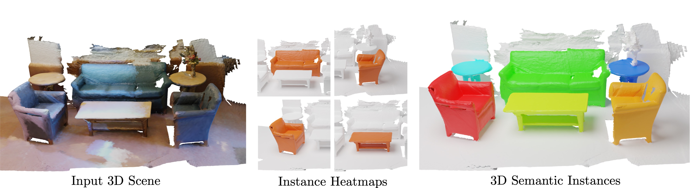

## Mask3D: Mask Transformer for 3D Instance Segmentation
<div align="center">
<a href="https://www.vision.rwth-aachen.de/person/schult">Jonas Schult</a><sup>1</sup>, <a href="https://francisengelmann.github.io/">Francis Engelmann</a><sup>2,3</sup>, <a href="https://www.vision.rwth-aachen.de/person/10/">Alexander Hermans</a><sup>1</sup>, <a href="https://orlitany.github.io/">Or Litany</a><sup>4</sup>, <a href="https://inf.ethz.ch/people/person-detail.MjYyNzgw.TGlzdC8zMDQsLTg3NDc3NjI0MQ==.html">Siyu Tang</a><sup>3</sup>,  <a href="https://www.vision.rwth-aachen.de/person/1/">Bastian Leibe</a><sup>1</sup>

<sup>1</sup>RWTH Aachen University <sup>2</sup>ETH AI Center <sup>3</sup>ETH Zurich <sup>4</sup>NVIDIA

Mask3D predicts accurate 3D semantic instances achieving state-of-the-art on ScanNet, ScanNet200, S3DIS and STPLS3D.

[](https://paperswithcode.com/sota/3d-instance-segmentation-on-scannetv2?p=mask3d-for-3d-semantic-instance-segmentation)
[](https://paperswithcode.com/sota/3d-instance-segmentation-on-scannet200?p=mask3d-for-3d-semantic-instance-segmentation)
[](https://paperswithcode.com/sota/3d-instance-segmentation-on-s3dis?p=mask3d-for-3d-semantic-instance-segmentation)
[](https://paperswithcode.com/sota/3d-instance-segmentation-on-stpls3d?p=mask3d-for-3d-semantic-instance-segmentation)

<a href="https://pytorch.org/get-started/locally/"></a>
<a href="https://pytorchlightning.ai/"></a>
<a href="https://hydra.cc/"></a>



</div>
<br><br>

[[Project Webpage](https://jonasschult.github.io/Mask3D/)]    [[Paper](https://arxiv.org/abs/2210.03105)]

## Code structure
We adapt the codebase of [Mix3D](https://github.com/kumuji/mix3d) which provides a highly modularized framework for 3D Semantic Segmentation based on the MinkowskiEngine.

```
├── mix3d
│   ├── main_instance_segmentation.py <- the main file
│   ├── conf                          <- hydra configuration files
│   ├── datasets
│   │   ├── preprocessing             <- folder with preprocessing scripts
│   │   ├── semseg.py                 <- indoor dataset
│   │   └── utils.py        
│   ├── models                        <- Mask3D modules
│   ├── trainer
│   │   ├── __init__.py
│   │   └── trainer.py                <- train loop
│   └── utils
├── data
│   ├── processed                     <- folder for preprocessed datasets
│   └── raw                           <- folder for raw datasets
├── scripts                           <- train scripts
├── docs
├── README.md
└── saved                             <- folder that stores models and logs
```

### Dependencies :memo:
The main dependencies of the project are the following:
```yaml
python: 3.10.6
cuda: 11.6
```
You can set up a conda environment as follows
```
conda create --name=mask3d python=3.10.6
conda activate mask3d

conda update -n base -c defaults conda
conda install openblas-devel -c anaconda

pip install torch torchvision --extra-index-url https://download.pytorch.org/whl/cu116
pip install torch-scatter -f https://data.pyg.org/whl/torch-1.12.1+cu116.html

pip install ninja==1.10.2.3
pip install pytorch-lightning fire imageio tqdm wandb python-dotenv pyviz3d scipy plyfile scikit-learn trimesh loguru albumentations volumentations

pip install antlr4-python3-runtime==4.8
pip install black==21.4b2
pip install omegaconf==2.0.6 hydra-core==1.0.5 --no-deps
pip install 'git+https://github.com/facebookresearch/detectron2.git@710e7795d0eeadf9def0e7ef957eea13532e34cf' --no-deps

cd third_party/pointnet2 && python setup.py install
```

### Data preprocessing :hammer:
After installing the dependencies, we preprocess the datasets.
First, we apply Felzenswalb and Huttenlocher's Graph Based Image Segmentation algorithm to the test scenes using the default parameters.
Please refer to the [original repository](https://github.com/ScanNet/ScanNet/tree/master/Segmentator) for details.
Put the resulting segmentations in `./data/raw/scannet_test_segments`.
```
datasets/preprocessing/s3dis_preprocessing.py preprocess \
--data_dir="PATH_TO_Stanford3dDataset_v1.2" \
--save_dir="../../data/processed/s3dis"
```

```
datasets/preprocessing/scannet_preprocessing.py preprocess \
--data_dir="PATH_TO_RAW_SCANNET_DATASET" \
--save_dir="../../data/processed/scannet" \
--git_repo="PATH_TO_SCANNET_GIT_REPO"
```

### Training and testing :train2:
Train Mask3D on the ScanNet dataset:
```yaml
python main_instance_segmentation.py
```

## Trained checkpoints :floppy_disk:
We provide detailed scores and network configurations with trained checkpoints.

### [S3DIS](http://buildingparser.stanford.edu/dataset.html) (pretrained on ScanNet train+val)
Following PointGroup, HAIS and SoftGroup, we finetune a model pretrained on ScanNet ([config](./scripts/scannet/scannet_pretrain_for_s3dis.sh) and [checkpoint](https://omnomnom.vision.rwth-aachen.de/data/mask3d/checkpoints/s3dis/scannet_pretrained/scannet_pretrained.ckpt)).
| Dataset | AP | AP_50 | AP_25 | Config | Checkpoint :floppy_disk: | Scores :chart_with_upwards_trend: | Visualizations :telescope:
|:-:|:-:|:-:|:-:|:-:|:-:|:-:|:-:|
| Area 1 | 69.3 | 81.9 | 87.7 | [config](scripts/s3dis/s3dis_pretrained.sh) | [checkpoint](https://omnomnom.vision.rwth-aachen.de/data/mask3d/checkpoints/s3dis/scannet_pretrained/area1_scannet_pretrained.ckpt) | [scores](./docs/detailed_scores/s3dis/scannet_pretrained/s3dis_area1_scannet_pretrained.txt) | [visualizations](https://omnomnom.vision.rwth-aachen.de/data/mask3d/visualizations/s3dis/scannet_pretrained/area_1/)
| Area 2 | 44.0 | 59.5 | 66.5 | [config](scripts/s3dis/s3dis_pretrained.sh) | [checkpoint](https://omnomnom.vision.rwth-aachen.de/data/mask3d/checkpoints/s3dis/scannet_pretrained/area2_scannet_pretrained.ckpt) | [scores](./docs/detailed_scores/s3dis/scannet_pretrained/s3dis_area2_scannet_pretrained.txt) | [visualizations](https://omnomnom.vision.rwth-aachen.de/data/mask3d/visualizations/s3dis/scannet_pretrained/area_2/)
| Area 3 | 73.4 | 83.2 | 88.2 | [config](scripts/s3dis/s3dis_pretrained.sh) | [checkpoint](https://omnomnom.vision.rwth-aachen.de/data/mask3d/checkpoints/s3dis/scannet_pretrained/area3_scannet_pretrained.ckpt) | [scores](./docs/detailed_scores/s3dis/scannet_pretrained/s3dis_area3_scannet_pretrained.txt) | [visualizations](https://omnomnom.vision.rwth-aachen.de/data/mask3d/visualizations/s3dis/scannet_pretrained/area_3/)
| Area 4 | 58.0 | 69.5 | 74.9 | [config](scripts/s3dis/s3dis_pretrained.sh) | [checkpoint](https://omnomnom.vision.rwth-aachen.de/data/mask3d/checkpoints/s3dis/scannet_pretrained/area4_scannet_pretrained.ckpt) | [scores](./docs/detailed_scores/s3dis/scannet_pretrained/s3dis_area4_scannet_pretrained.txt) | [visualizations](https://omnomnom.vision.rwth-aachen.de/data/mask3d/visualizations/s3dis/scannet_pretrained/area_4/)
| Area 5 | 57.8 | 71.9 | 77.2 | [config](scripts/s3dis/s3dis_pretrained.sh) | [checkpoint](https://omnomnom.vision.rwth-aachen.de/data/mask3d/checkpoints/s3dis/scannet_pretrained/area5_scannet_pretrained.ckpt) | [scores](./docs/detailed_scores/s3dis/scannet_pretrained/s3dis_area5_scannet_pretrained.txt) | [visualizations](https://omnomnom.vision.rwth-aachen.de/data/mask3d/visualizations/s3dis/scannet_pretrained/area_5/)
| Area 6 | 68.4 | 79.9 | 85.2 | [config](scripts/s3dis/s3dis_pretrained.sh) | [checkpoint](https://omnomnom.vision.rwth-aachen.de/data/mask3d/checkpoints/s3dis/scannet_pretrained/area6_scannet_pretrained.ckpt) | [scores](./docs/detailed_scores/s3dis/scannet_pretrained/s3dis_area6_scannet_pretrained.txt) | [visualizations](https://omnomnom.vision.rwth-aachen.de/data/mask3d/visualizations/s3dis/scannet_pretrained/area_6/)

### [S3DIS](http://buildingparser.stanford.edu/dataset.html) (from scratch)

| Dataset | AP | AP_50 | AP_25 | Config | Checkpoint :floppy_disk: | Scores :chart_with_upwards_trend: | Visualizations :telescope:
|:-:|:-:|:-:|:-:|:-:|:-:|:-:|:-:|
| Area 1 | 74.1 | 85.1 | 89.6 | [config](scripts/s3dis/s3dis_from_scratch.sh) | [checkpoint](https://omnomnom.vision.rwth-aachen.de/data/mask3d/checkpoints/s3dis/from_scratch/area1_from_scratch.ckpt) | [scores](./docs/detailed_scores/s3dis/from_scratch/s3dis_area1_from_scratch.txt) | [visualizations](https://omnomnom.vision.rwth-aachen.de/data/mask3d/visualizations/s3dis/from_scratch/area_1/)
| Area 2 | 44.9 | 57.1 | 67.9 | [config](scripts/s3dis/s3dis_from_scratch.sh) | [checkpoint](https://omnomnom.vision.rwth-aachen.de/data/mask3d/checkpoints/s3dis/from_scratch/area2_from_scratch.ckpt) | [scores](./docs/detailed_scores/s3dis/from_scratch/s3dis_area2_from_scratch.txt) | [visualizations](https://omnomnom.vision.rwth-aachen.de/data/mask3d/visualizations/s3dis/from_scratch/area_2/)
| Area 3 | 74.4 | 84.4 | 88.1 | [config](scripts/s3dis/s3dis_from_scratch.sh) | [checkpoint](https://omnomnom.vision.rwth-aachen.de/data/mask3d/checkpoints/s3dis/from_scratch/area3_from_scratch.ckpt) | [scores](./docs/detailed_scores/s3dis/from_scratch/s3dis_area3_from_scratch.txt) | [visualizations](https://omnomnom.vision.rwth-aachen.de/data/mask3d/visualizations/s3dis/from_scratch/area_3/)
| Area 4 | 63.8 | 74.7 | 81.1 | [config](scripts/s3dis/s3dis_from_scratch.sh) | [checkpoint](https://omnomnom.vision.rwth-aachen.de/data/mask3d/checkpoints/s3dis/from_scratch/area4_from_scratch.ckpt) | [scores](./docs/detailed_scores/s3dis/from_scratch/s3dis_area4_from_scratch.txt) | [visualizations](https://omnomnom.vision.rwth-aachen.de/data/mask3d/visualizations/s3dis/from_scratch/area_4/)
| Area 5 | 56.6 | 68.4 | 75.2 | [config](scripts/s3dis/s3dis_from_scratch.sh) | [checkpoint](https://omnomnom.vision.rwth-aachen.de/data/mask3d/checkpoints/s3dis/from_scratch/area5_from_scratch.ckpt) | [scores](./docs/detailed_scores/s3dis/from_scratch/s3dis_area5_from_scratch.txt) | [visualizations](https://omnomnom.vision.rwth-aachen.de/data/mask3d/visualizations/s3dis/from_scratch/area_5/)
| Area 6 | 73.3 | 83.4 | 87.8 | [config](scripts/s3dis/s3dis_from_scratch.sh) | [checkpoint](https://omnomnom.vision.rwth-aachen.de/data/mask3d/checkpoints/s3dis/from_scratch/area6_from_scratch.ckpt) | [scores](./docs/detailed_scores/s3dis/from_scratch/s3dis_area6_from_scratch.txt) | [visualizations](https://omnomnom.vision.rwth-aachen.de/data/mask3d/visualizations/s3dis/from_scratch/area_6/)

### [ScanNet v2](https://kaldir.vc.in.tum.de/scannet_benchmark/semantic_instance_3d?metric=ap)

| Dataset | AP | AP_50 | AP_25 | Config | Checkpoint :floppy_disk: | Scores :chart_with_upwards_trend: | Visualizations :telescope:
|:-:|:-:|:-:|:-:|:-:|:-:|:-:|:-:|
| ScanNet val  | 55.2 | 73.7 | 83.5 | [config](scripts/scannet/scannet_val.sh) | [checkpoint](https://omnomnom.vision.rwth-aachen.de/data/mask3d/checkpoints/scannet/scannet_val.ckpt) | [scores](./docs/detailed_scores/scannet_val.txt) | [visualizations](https://omnomnom.vision.rwth-aachen.de/data/mask3d/visualizations/scannet/val/)
| ScanNet test | 56.6 | 78.0 | 87.0 | [config](scripts/scannet/scannet_benchmark.sh) | [checkpoint](https://omnomnom.vision.rwth-aachen.de/data/mask3d/checkpoints/scannet/scannet_benchmark.ckpt) | [scores](http://kaldir.vc.in.tum.de/scannet_benchmark/result_details?id=1081) | [visualizations](https://omnomnom.vision.rwth-aachen.de/data/mask3d/visualizations/scannet/test/)

### [ScanNet 200](https://kaldir.vc.in.tum.de/scannet_benchmark/scannet200_semantic_instance_3d)

| Dataset | AP | AP_50 | AP_25 | Config | Checkpoint :floppy_disk: | Scores :chart_with_upwards_trend: | Visualizations :telescope:
|:-:|:-:|:-:|:-:|:-:|:-:|:-:|:-:|
| ScanNet200 val | 27.4 | 37.0 | 42.3 | [config](scripts/scannet200/scannet200_val.sh) | [checkpoint](https://omnomnom.vision.rwth-aachen.de/data/mask3d/checkpoints/scannet200/scannet200_val.ckpt) | [scores](./docs/detailed_scores/scannet200_val.txt) | [visualizations](https://omnomnom.vision.rwth-aachen.de/data/mask3d/visualizations/scannet200/val/)
| ScanNet200 test | 27.8 | 38.8 | 44.5 | [config](scripts/scannet200/scannet200_benchmark.sh) | [checkpoint](https://omnomnom.vision.rwth-aachen.de/data/mask3d/checkpoints/scannet200/scannet200_benchmark.ckpt) | [scores](https://kaldir.vc.in.tum.de/scannet_benchmark/result_details?id=1242) | [visualizations](https://omnomnom.vision.rwth-aachen.de/data/mask3d/visualizations/scannet200/test/)

### [STPLS3D](https://www.stpls3d.com/)

| Dataset | AP | AP_50 | AP_25 | Config | Checkpoint :floppy_disk: | Scores :chart_with_upwards_trend: | Visualizations :telescope:
|:-:|:-:|:-:|:-:|:-:|:-:|:-:|:-:|
| STPLS3D val | 57.3 | 74.3 | 81.6 | [config](scripts/stpls3d/stpls3d_val.sh) | [checkpoint](https://omnomnom.vision.rwth-aachen.de/data/mask3d/checkpoints/stpls3d/stpls3d_val.ckpt) | [scores](./docs/detailed_scores/stpls3d.txt) | [visualizations](https://omnomnom.vision.rwth-aachen.de/data/mask3d/visualizations/stpls3d/)
| [STPLS3D test](https://codalab.lisn.upsaclay.fr/competitions/4646#results) | 63.4 | 79.2 | 85.6 | [config](scripts/stpls3d/stpls3d_benchmark.sh) | [checkpoint](https://omnomnom.vision.rwth-aachen.de/data/mask3d/checkpoints/stpls3d/stpls3d_benchmark.zip) | [scores](https://codalab.lisn.upsaclay.fr/competitions/4646#results) | visualizations

## BibTeX :pray:
```
@article{Schult22,
  title     = {{Mask3D for 3D Semantic Instance Segmentation}},
  author    = {Schult, Jonas and Engelmann, Francis and Hermans, Alexander and Litany, Or and Tang, Siyu and Leibe, Bastian},
  booktitle = {{arXiv:2210.03105}},
  year      = {2022}
}
```
